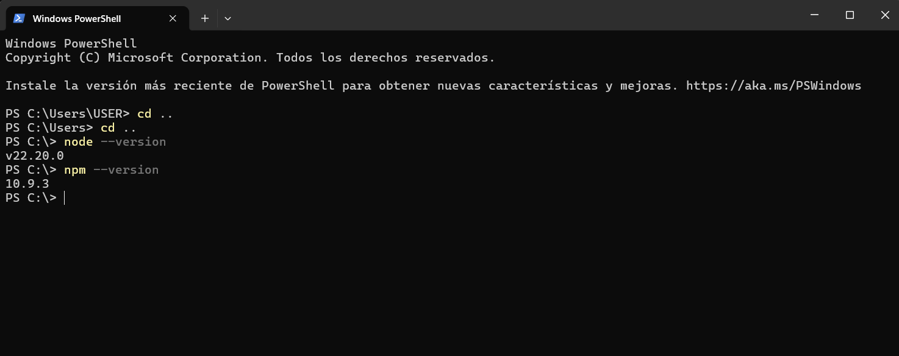
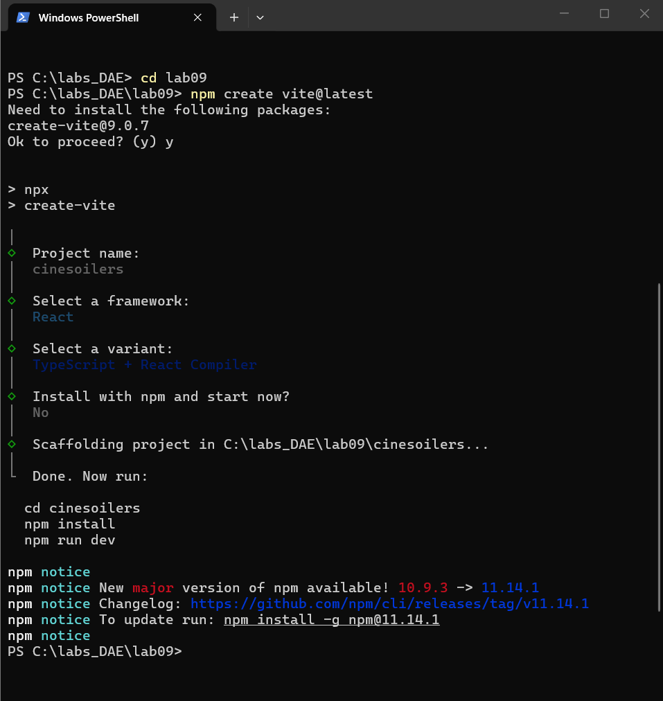
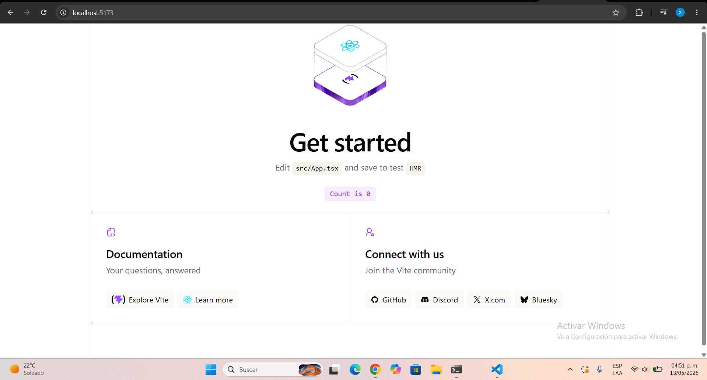
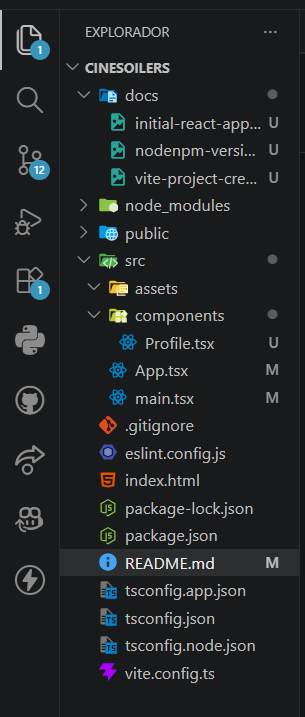
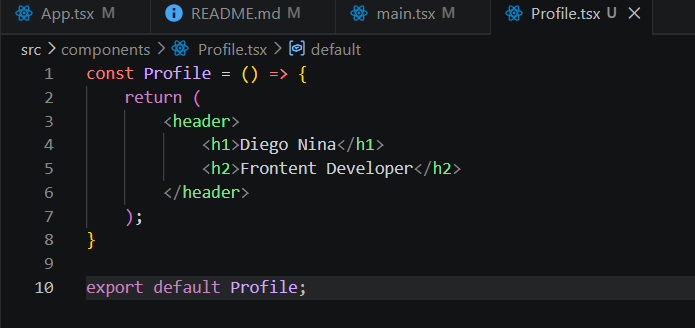
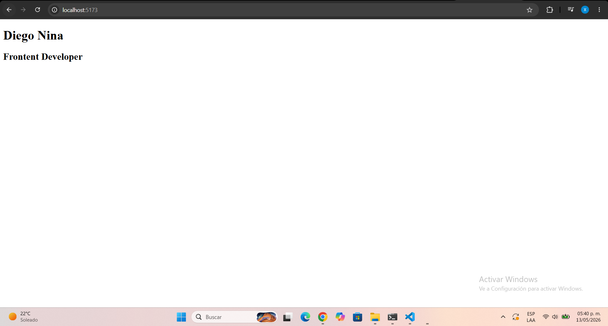
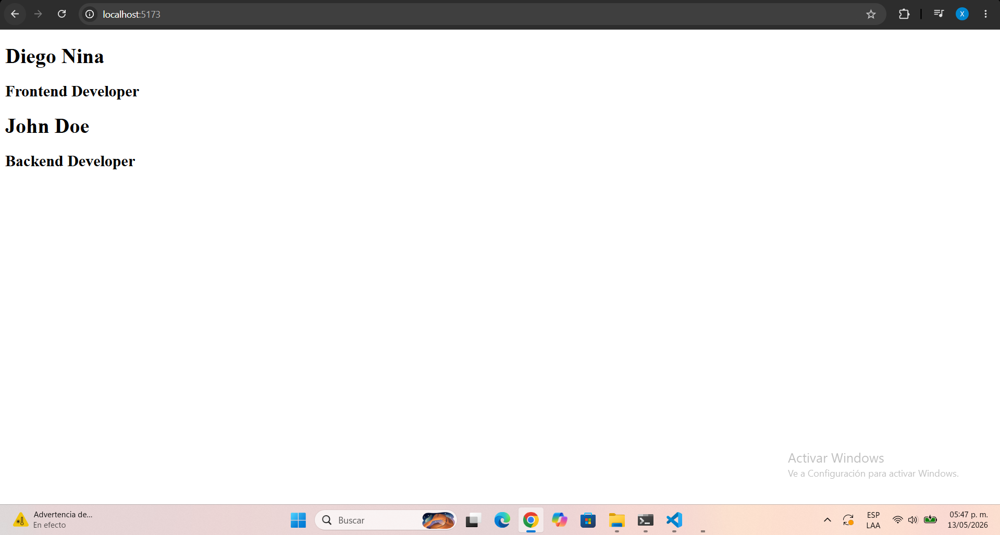

# CineSoilerS — Frontend Setup Guide

## 1. Verificación de NodeJS y npm

Antes de crear el proyecto, se verificó la instalación correcta de NodeJS y npm en el entorno local.

### Comandos ejecutados

```bash
node -v
npm -v
```

### Evidencia

#### NodeJS y npm Version



---

## 2. Creación del entorno y proyecto

Se utilizó Vite como herramienta de inicialización para crear un proyecto moderno basado en React y TypeScript.

### Comando de creación

```bash
npm create vite@latest
```
### Instalación de dependencias

```bash
npm install
```

### Evidencia

#### Vite Project Creation



## 3. Levantamiento del proyecto

Una vez instaladas las dependencias, se ejecutó el servidor de desarrollo local usando Vite.

### Comando ejecutado

```bash
npm run dev
```

### Resultado esperado

El servidor local queda disponible en:

```plaintext
http://localhost:5173/
```

### Evidencia

#### Initial React App


---

## 4. Limpieza del proyecto y estructura de carpetas actual

Se eliminaron los archivos de ejemplo generados automáticamente por Vite para iniciar con una estructura limpia y profesional.

### Archivos eliminados

```plaintext
src/assets/react.svg
src/App.css
src/index.css
```

### Nuevo contenido de App.tsx

```tsx
function App() {
  return (
    <div>
      <h1>CineSoilerS</h1>
    </div>
  );
}

export default App;
```

### Resultado obtenido

La aplicación ahora muestra únicamente el título principal del proyecto.

### Estructura actual del proyecto


### Evidencia

#### Clean Project Structure


---

## 5. Creación de nuevo componente Profile

Se creó el primer componente reutilizable del proyecto para validar la arquitectura inicial basada en componentes.

### Ruta del componente

```plaintext
src/components/Profile/Profile.tsx
```

### Código implementado

```tsx
const Profile = () => {
    return (
        <header>
            <h1>Diego Nina</h1>
            <h2>Frontent Developer</h2>
        </header>
    );
}

export default Profile;
```
### Evidencia



### Integración en App.tsx

```tsx
import Profile from './components/Profile';

function App() {
  return (
    <Profile />
  )
}

export default App;
```

### Evidencia

#### Profile Component Render


---

---

## 6. Componente Profile dinámico

El componente `Profile` fue modificado para recibir props dinámicas desde `App.tsx`.

### Nuevo componente

```tsx
type ProfileProps = {
    name: string;
    role: string;
}

const Profile = ({ name, role }: ProfileProps) => {
    return (
        <header>
            <h1>{name}</h1>
            <h2>{role}</h2>
        </header>
    );
}

export default Profile;
```

### Uso en App.tsx

### Evidencia

#### Dynamic Profile Component Render


# Conclusión

Se logró preparar correctamente el entorno inicial del proyecto CineSoilerS utilizando React, Vite y TypeScript, estableciendo una base limpia, organizada y escalable para futuras funcionalidades del sistema e-commerce.